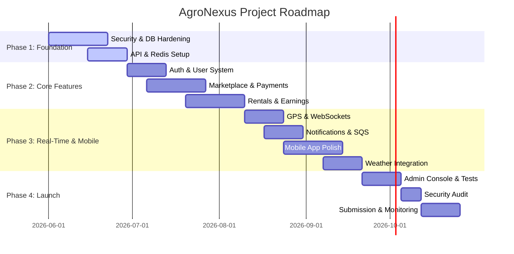

# AgroNexus Implementation Roadmap & Launch Checklist

This document details the rollout roadmap, pre-launch verification checklist, and post-launch monitoring strategy.

---

## 1. Implementation Roadmap

### Phase 1 — Foundation (Weeks 1–4)
* **Week 1–2 (Security Fixes)**: Enable RLS, fix JWT, add rate limiting, secrets management, input validation, and Flyway setup.
* **Week 2–3 (API Standardization)**: Universal response envelope, versioning, pagination on all list endpoints, and global exception handler.
* **Week 3–4 (Database Hardening)**: Add missing indexes, soft delete, audit tables, GPS table partitioning, and PostGIS extension.
* **Week 4 (Redis Integration)**: Session store, rate limiter, weather cache, product listing cache, and connection pool tuning.

### Phase 2 — Core Features (Weeks 5–10)
* **Week 5–6 (Auth & User System)**: OTP flow, refresh token rotation, RBAC `@PreAuthorize`, device tracking, and security audit log.
* **Week 6–7 (Marketplace)**: Full-text search, categories, images via CDN, wishlist, reviews, and inventory management.
* **Week 7–8 (Orders & Payments)**: Order FSM, Razorpay integration, idempotency, webhook handler, and invoice generation.
* **Week 9–10 (Equipment Rental)**: Listing, availability calendar, booking flow, rental payment, and earnings dashboard.

### Phase 3 — Real-Time & Mobile (Weeks 11–16)
* **Week 11–12 (GPS Tracking)**: WebSocket server, Redis pub/sub, map integration, geofencing, and route history.
* **Week 12–13 (Notifications)**: FCM push (Android + iOS), AWS SES email, in-app feed, and SQS async queue.
* **Week 13–15 (Mobile App Polish)**: Offline support, image caching, deep links, accessibility, and performance profiling.
* **Week 15–16 (Weather & Recommendations)**: OpenWeather integration, cached responses, farming tips engine, and severe weather alerts.

### Phase 4 — Launch (Weeks 17–20)
* **Week 17–18 (Admin Dashboard)**: User/equipment verification, order monitoring, analytics, audit log viewer, and system health.
* **Week 18–19 (Load Testing & Hardening)**: k6 load tests to 20,000 concurrent users, fix bottlenecks, tune DB pool, and enable CDN.
* **Week 19 (Security Audit)**: Penetration test, OWASP ZAP scan, dependency audit, and fix all critical findings.
* **Week 20 (App Store Submission)**: Play Store + App Store review, production deploy, monitoring go-live, and on-call setup.

---

## 2. Production Launch Checklist

### 🔒 Security Checklist
- [ ] All Supabase RLS policies enabled and tested
- [ ] JWT refresh token rotation implemented
- [ ] Rate limiting on auth endpoints (Redis-backed)
- [ ] Secrets in AWS Secrets Manager (not `.properties` or `.env`)
- [ ] File upload validation (MIME, size, AV scan)
- [ ] HTTPS everywhere, HSTS header set
- [ ] Payment webhook HMAC verification
- [ ] RBAC `@PreAuthorize` on all service methods
- [ ] OWASP Top 10 penetration test passed
- [ ] Dependency vulnerability scan clean

### ⚡ Performance Checklist
- [ ] Redis cache for weather (30 min TTL)
- [ ] Redis cache for product listings (5 min TTL)
- [ ] Database indexes on all FK and search columns
- [ ] GPS table partitioned by month
- [ ] Images served via CloudFront CDN
- [ ] HikariCP pool sized to 20 connections
- [ ] Load test: 20,000 concurrent users passed
- [ ] Notifications sent async via SQS
- [ ] N+1 query audit completed
- [ ] API p99 latency <500ms under load

### 📱 Mobile App Checklist
- [ ] Offline mode with local SQLite cache
- [ ] FCM push notifications (Android + iOS)
- [ ] Deep linking configured
- [ ] Accessibility labels (WCAG 2.1 AA)
- [ ] Image lazy loading with placeholder
- [ ] Bundle size <10MB initial download
- [ ] Tablet layout tested (iPad, 10" Android)
- [ ] App Store screenshots (6.7", 5.5")
- [ ] Play Store listing complete with ASO
- [ ] Privacy policy URL in both store listings

### ⚙️ Ops & Compliance Checklist
- [ ] Automated daily database backups with 30d retention
- [ ] Disaster recovery runbook tested
- [ ] Monitoring dashboards live (Grafana)
- [ ] On-call rotation configured (PagerDuty)
- [ ] Flyway migrations tested on staging DB
- [ ] CI/CD pipeline green for 5 consecutive runs
- [ ] Payment gateway live keys tested end-to-end
- [ ] GST invoice compliance verified
- [ ] Privacy policy and T&C legally reviewed
- [ ] Rollback procedure tested successfully

---

## 3. Post-Launch Monitoring Strategy

### 🔎 Week 1 Post-Launch
> **Action Plan**: Monitor hourly. Watch error rates, payment failures, WebSocket connection counts, and database connection pool levels.
> - **On-Call Support**: 24/7 pager duty rotation active.
> - **Target Performance**: p99 API latency < 500ms.

### 📊 Month 1
> **Action Plan**: Weekly capacity and load review.
> - **Optimization**: Tune auto-scaling thresholds for CPU and memory usage.
> - **Analytics**: Review slow query logs, analyze user funnel drop-offs, and A/B test onboarding flow.

### 🔄 Ongoing Operations
> **Action Plan**: Regular audits and updates.
> - **Maintenance**: Monthly dependency updates and quarterly security reviews.
> - **Compliance**: Annual PCI-DSS audit.
> - **Data Retention**: Archive GPS tracking coordinates older than 6 months to cold storage.
